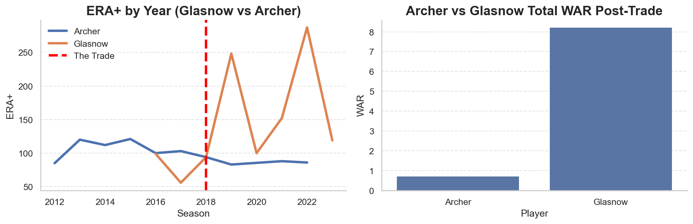
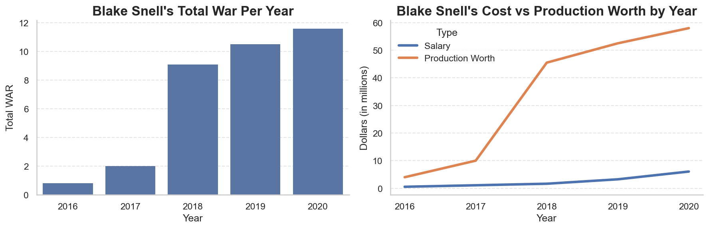

# The Tampa Bay Rays' 2020 Pitching Staff: A Masterclass in Market Efficiency

An analysis in how the 2020 Tampa Bay Rays were able to build a top-tier pitching staff on the smallest budget in the league. Using cost-per-war analysis, this project explores how market efficiency is crucial for small-market teams in a league full of sharks. 

## What is being investigated?

In 2020 the Rays finished 3rd in the league in ERA while having one of the tightest budgets in the league. This dives into how exactly the front office was able to get them there, through player development, trades, and budget-friendly signings. 

## Findings 

-  The Archer/Glasnow trade was a stroke of genius by the Rays' front office, shipping off an aging all-star in exchange for a projectable prospect. This gamble paid off immensely with Glasnow posting more than 7 WAR post-trade than Archer, while being on a cheaper contract.
- Blake Snell's development saw the Rays producing a pre-arbitration Cy Young level pitcher. Using cost-per-war analysis, the Rays were able to achieve production value around 10x of what he actually cost to them.
- Ryan Yarbrough had an unorthodox sidewinder release, backed by Statcast data with the largest shoulder distance from center of mass at release point. Acquired through trade the Rays were able to cash in, gaining elite-production at a low cost while shipping off an expensive reliever in Drew Smyly
- The Rays used a Moneyball-esque move to mimic the AL closer of the year, utilizing a crew of 3 cheap relievers who combined for Hendriks' production at a fraction of the cost

## Method

I conducted cost per war analysis by player, utilizing a cost/war statistic which came from a recent FanGraphs article. In this article, the cost/war for all players around the league was around $4-6 million. I used $5 million as a consistent number throughout the project. Also, all salaries from the 2020 season are league-adjusted for that year, which was 37% of original salaries due to the shortened 60 game season.

## Tools

Python, Pandas, Seaborn, Matplotlib

## Data Sources

Baseball Statistics and Salary Data
- [Baseball Reference](https://www.baseball-reference.com)
- [FanGraphs](https://www.fangraphs.com)
- [Spotrac](https://www.spotrac.com)
- [The Baseball Cube](https://www.thebaseballcube.com)

Statcast Data:
- [Baseball Savant](https://baseballsavant.mlb.com)

Scouting Data:
- [MLB.com](https://www.mlb.com)
- [Baseball America](https://www.baseballamerica.com)

